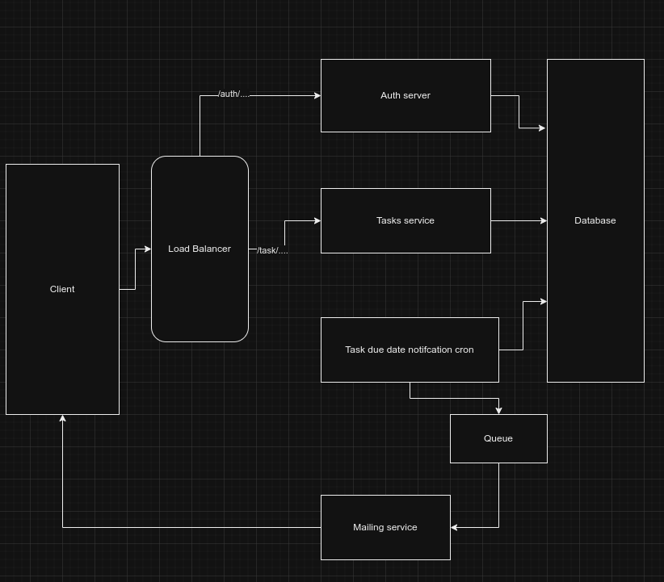

# Task management backend

## Top level view of the application



## Commands to start the application

- start authentication server

```
cd authentication-service
npm install
npm run start
```

- start task server

```
cd task-service
npm install
npm run start
```

- start nginx load balancer

```
sudo nginx -c $PWD/nginx.conf
```

## Exposed APIs

- base path 127.0.0.1

### 1: user registration

```
POST /auth/register
Body {username, password, email}
```

### 2: user login

```
POST /auth/login
Body {username, password}
```

### 3: get all tasks of user

```
GET /tasks
```

### 4: create new task

```
POST /tasks
BODY {title, status, description, duedate}
```

### 5: update task

```
PUT /tasks/:taskId
BODY {title, status, description, duedate}
```

### 6: delete task

```
DELETE /tasks/:taskId
```
